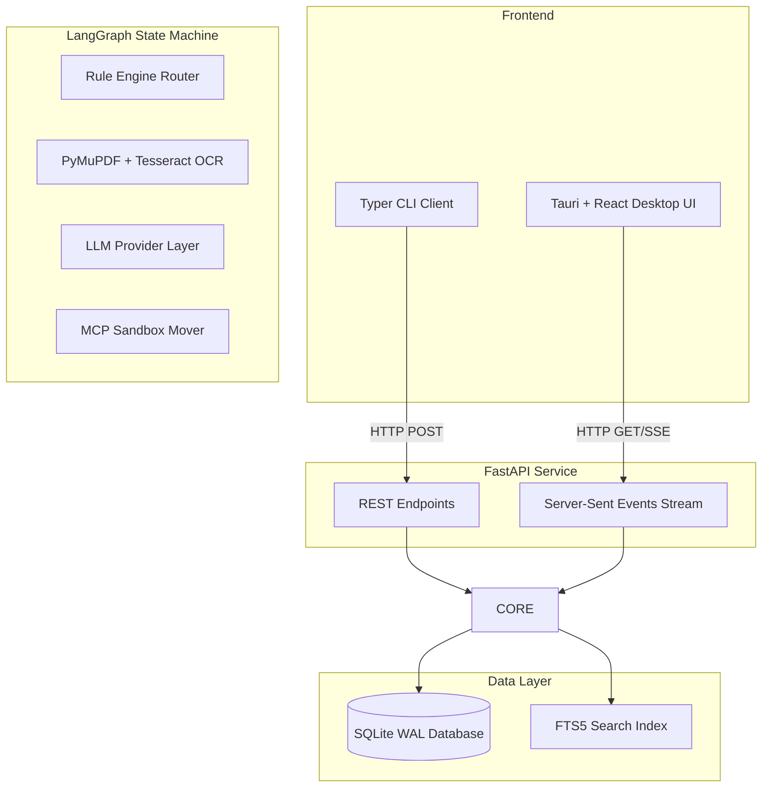
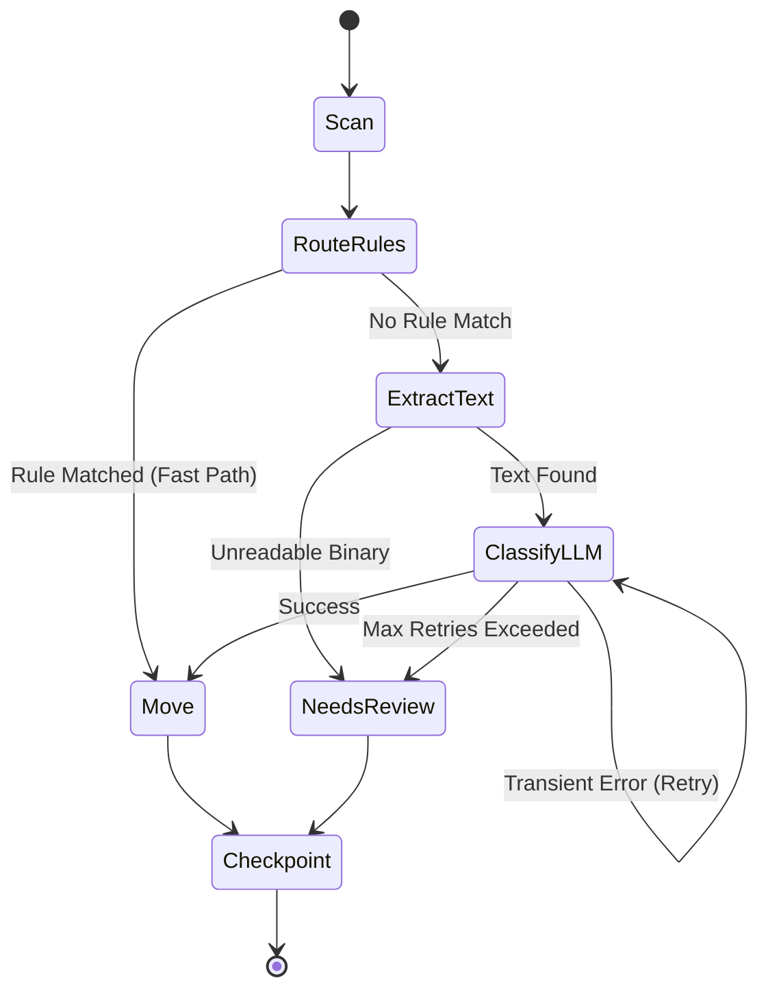

# TidyFlow

TidyFlow is a local-first, privacy-focused, agentic AI file organization system. It scans messy directories, intelligently categorizes files using a hybrid engine (fast-path rules + LLM text classification), and safely moves them into organized folders.

## 🚀 Architecture Overview

TidyFlow is designed around a fault-tolerant state machine (LangGraph), an asynchronous concurrent loop (asyncio), and an isolated filesystem sandboxing server (FastMCP) to ensure absolute safety when running AI models on your local machine.

### High-Level Architecture Diagram

## 🧠 Core Components Deep Dive

### 1. LangGraph Orchestrator
At the heart of TidyFlow is a deterministic state machine built with LangGraph. Instead of a monolithic processing function, a file's journey is modeled as a series of states.
- **Why LangGraph?** It provides native support for cyclical graphs. If an LLM encounters a transient error (e.g., HTTP 429 Rate Limit), the graph natively routes the file backward in the pipeline to retry, up to a maximum threshold, before gracefully dumping it into a `needs_review` bucket.

### 2. FastMCP Filesystem Sandbox
AI Agents are dangerous. If an LLM hallucinates, it could accidentally command the system to delete critical OS files.
- **Why FastMCP?** We implemented the Model Context Protocol (MCP) to act as a strict firewall between the AI and the hard drive. The LLM only calculates the target category. The actual `copy_file` operation happens inside the MCP server, which strictly enforces directory boundaries using `pathlib.Path.resolve()` to prevent Path Traversal attacks.

### 3. Asynchronous Concurrency with Backpressure
Scanning a hard drive yields thousands of files instantly. If we threw them all at an LLM API simultaneously, the computer would run out of RAM and the API provider would ban the account.
- **Implementation**: We use an `asyncio.Queue` to buffer incoming files, and an `asyncio.Semaphore` to rigidly restrict the maximum number of simultaneous active network connections, creating perfect backpressure.

### 4. Zero-Config Database (SQLite WAL)
We chose SQLite to keep TidyFlow a lightweight desktop app.
- **The Concurrency Problem**: Default SQLite locks the database during writes, crashing under high concurrency.
- **The Solution**: We enabled Write-Ahead Logging (WAL) and funneled all database writes through a single background coroutine. This allows 10+ LangGraph workers to read from the database concurrently while the single writer asynchronously processes the write queue without locking.

## ⚙️ The State Machine Workflow

## 🛠️ Technology Stack
- **Python 3.11+**: Core backend runtime.
- **FastAPI**: REST and SSE API layer.
- **LangGraph**: Agentic state machine orchestration.
- **PyMuPDF & Tesseract**: Rapid PDF and Image text extraction.
- **SQLite (WAL + FTS5)**: Concurrency-safe local storage and instant full-text search.
- **FastMCP**: Filesystem sandboxing.
- **Tauri + React**: Lightweight desktop GUI frontend.
- **Typer & Rich**: Beautiful terminal interfaces.
