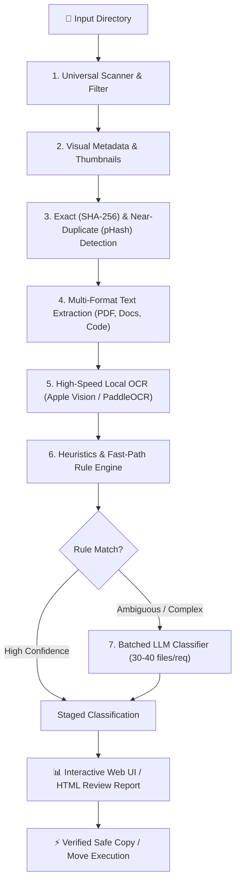

# 🌊 TidyFlow 2.0 — Universal AI Workspace & File Organizer

<p align="center">
  
</p>

<p align="center">
  <b>A privacy-first, agentic AI file organization system with interactive web controls, native OCR, batched LLM intelligence, duplicate detection, and safe execution.</b>
</p>

<p align="center">
  <a href="#-architecture--how-it-works"></a>
  <a href="#-quickstart--installation"></a>
  <a href="#-web-ui--quickstart"></a>
  <a href="#-running-unit-tests"></a>
  <a href="#-license--privacy"></a>
</p>

---

## 📖 Table of Contents

- [✨ Overview](#-overview)
- [🚀 Key Features](#-key-features)
- [🧠 Architecture & How It Works](#-architecture--how-it-works)
- [📦 Installation & Setup](#-installation--setup)
- [🖥️ Running the Web UI (Recommended)](#️-running-the-web-ui-recommended)
- [⌨️ Running via CLI](#️-running-via-cli)
- [⚙️ Configuration (`config.yaml` & `.env`)](#️-configuration-configyaml--env)
- [🎯 Interactive Modes & Workflows](#-interactive-modes--workflows)
  - [1. AI Organization Architect](#1-ai-organization-architect)
  - [2. Quick Triage Queue & AI Auto-Clustering](#2-quick-triage-queue--ai-auto-clustering)
  - [3. Review Chat Assistant](#3-review-chat-assistant)
- [🔒 Privacy & Safety Guarantees](#-privacy--safety-guarantees)
- [🧪 Running Unit Tests](#-running-unit-tests)
- [📁 Project Structure](#-project-structure)

---

## ✨ Overview

Messy `Downloads`, cluttered `Desktop`, or disorganized shared project folders often contain hundreds of mixed PDFs, screenshots, invoices, code snippets, archives, and datasets.

**TidyFlow** automates the entire decluttering process without risking accidental data loss:
1. It deep-scans the directory and inspects content via **native text extractors** and **local OCR** (Apple Vision on macOS / PaddleOCR).
2. It detects **exact SHA-256 duplicates** and **near-duplicate images** using perceptual hashing (`pHash`).
3. It uses **fast-path heuristics** for instant rule matches and **batched LLMs** (DeepSeek, OpenAI, Groq, Gemini, OpenRouter) for intelligent semantic classification.
4. It provides an **interactive dark-mode Web UI** with **AI Organization Architect**, **Card-by-Card Quick Triage**, and **1-Click AI Auto-Clustering** so you have 100% control over the proposed structure before any files are copied.

---

## 🚀 Key Features

| Feature | Description |
| :--- | :--- |
| **🤖 AI Organization Architect** | Define custom folder layouts using plain English (e.g. *"Separate my university lecture notes from bills"*), verify proposed taxonomy, and refine anytime via interactive chat. |
| **⚡ Native & Local OCR** | High-speed Apple Vision OCR on macOS (`src/native/macos_ocr.swift`) and PaddleOCR on Linux/Windows. Persistent SHA-256 cache prevents re-scanning. |
| **🔍 Multi-Format Text Extraction** | Extracts text and metadata from PDFs (`pymupdf`), Images (`PIL`), Office docs (`.docx`, `.xlsx`, `.pptx`), Code, Markdown, CSV, and SQL. |
| **🧹 Exact & Near-Duplicate Detection** | Identifies exact identical files via SHA-256 and visual near-duplicates (screenshots, resized images) via Perceptual Hashing + Union-Find clustering. |
| **🪄 1-Click AI Auto-Clustering** | Automatically groups unclassified or unrecognized files into clean, newly discovered topic folders in a single click. |
| **🎴 Card-by-Card Quick Triage** | Fullscreen distraction-free queue with thumbnail/OCR preview, number-key fast sort (`1`-`9`), and custom folder creation. |
| **🛡️ Safe Copy by Default** | Non-destructive execution: files are copied with SHA-256 integrity checks. Original files are never modified or deleted unless explicitly run in `--move` mode with `--confirm`. |
| **🔐 Secret Redaction** | Automatically scrubs API keys (OpenAI, AWS, GitHub), passwords, and auth tokens before payloads are sent to LLMs. |

---

## 🧠 Architecture & How It Works

TidyFlow processes files through a robust 7-stage pipeline:



### 1. Universal Scanner & Filter
Scans files while honoring ignore rules (`.DS_Store`, `.git`, `node_modules`, system files) and maximum file size limits (default: 200 MB).

### 2. Visual Metadata & Thumbnails
Generates base64 thumbnails (max 200px) for images and PDF first pages for instantaneous visual inspection in the UI.

### 3. Deduplication Engine
- **Exact Duplicates**: Computes SHA-256 digests and groups identical files.
- **Near Duplicates**: Computes perceptual hashes (`imagehash.phash`) on images and clusters visually similar files using Union-Find algorithm within a Hamming distance threshold.

### 4. Text Extraction & Secret Redaction
Directly extracts text from PDFs, Office documents, markdown, text files, and source code. Redacts detected tokens, private keys, and passwords.

### 5. Local OCR Engine
Extracts textual content from scanned documents and images. On macOS, uses the precompiled native Swift binary for sub-second OCR without heavy Python deep-learning overhead.

### 6. Heuristics & Rules
Scores filenames and extracted text against keyword sets and file extensions. Obvious matches bypass the LLM, reducing latency and saving API costs.

### 7. Dual-Mode Batched LLM Classification
Files that need semantic analysis are bundled into compact JSON payloads (15–40 files per batch). The LLM categorizes them, assigns confidence scores, suggests clean filenames, and provides short rationale:
- **Standard Mode**: Best-effort classification across full multi-category taxonomies.
- **Strict Mode**: Prevents false matches when using narrow custom criteria (e.g. specific project files).

---

## 📦 Installation & Setup

### 1. Prerequisites
- **Python**: `3.10` or higher
- **Node.js**: `18.0` or higher (for frontend build)
- **macOS / Linux / Windows** (macOS includes native Apple Vision OCR out-of-the-box)

### 2. Clone the Repository
```bash
git clone https://github.com/DEVJHAWAR11/Tidyflow.git
cd Tidyflow
```

### 3. Install Python Dependencies
```bash
python3 -m venv venv
source venv/bin/activate  # On Windows: venv\Scripts\activate
pip install -r requirements.txt
```

### 4. Build the Frontend
```bash
cd frontend
npm install
npm run build
cd ..
```

### 5. Configure Your LLM API Key
TidyFlow supports **DeepSeek**, **OpenAI**, **Groq**, **Gemini**, **OpenRouter**, or any **Custom OpenAI-compatible API**.

You can set your key in a `.env` file in the root directory:
```env
DEEPSEEK_API_KEY=your_deepseek_api_key_here
# or
OPENAI_API_KEY=your_openai_api_key_here
# or
GROQ_API_KEY=your_groq_api_key_here
# or
GEMINI_API_KEY=your_gemini_api_key_here
# or
OPENROUTER_API_KEY=your_openrouter_api_key_here
```

*Alternatively, configure it via the Web UI Settings modal (⚙️) or CLI command `python3 -m src.cli config-set-llm`.*

---

## 🖥️ Running the Web UI (Recommended)

Start the unified FastAPI + React server:
```bash
python3 -m src.cli serve --host 127.0.0.1 --port 8000
```
Open your browser at **[http://127.0.0.1:8000](http://127.0.0.1:8000)**.

### Web UI Workflow:
1. **AI Architect Tab**:
   - Type custom folder organization goals in natural language or click a preset template (e.g., *Freelancer & Client Work*, *Student & Academic*, *Tax & Finance*).
   - Review proposed categories, keywords, and rules.
2. **Scan & Extract**:
   - Select your input directory (e.g. `~/Downloads` or `/path/to/messy_files`) and target output directory.
   - Click **"Start Organization Run"** to watch live progress.
3. **Review & Apply**:
   - Inspect files in a rich table with thumbnails, OCR snippets, duplicate badges, and confidence indicators.
   - Use **"✨ Auto-Cluster with AI"** or **"⚡ Quick Triage Queue"** for unrecognized files.
   - Click **"Organize Files Now"** to execute safe copying with SHA-256 verification.

---

## ⌨️ Running via CLI

TidyFlow includes a comprehensive Typer-powered CLI (`tidy`).

### 1. Run Full Organization Pipeline
```bash
# Scan, extract text, deduplicate, classify with LLM, and generate reports
python3 -m src.cli run --input-dir "/path/to/messy_folder" --output-dir "/path/to/organized_folder"

# Auto-apply high-confidence matches (>= 85% confidence) directly
python3 -m src.cli run --input-dir "/path/to/folder" --output-dir "/path/to/organized" --auto-apply --confirm

# Move files instead of copying (requires explicit --confirm)
python3 -m src.cli run --input-dir "/path/to/folder" --output-dir "/path/to/organized" --move --confirm
```

### 2. Local Inventory Only (No LLM calls / Offline)
```bash
python3 -m src.cli inventory --input-dir "/path/to/folder" --output-dir "/path/to/output"
```

### 3. Apply Saved Decisions from CSV
```bash
python3 -m src.cli apply --decisions review_decisions.csv --output-dir "/path/to/organized" --confirm
```

### 4. Configure LLM Credentials via Keyring
```bash
python3 -m src.cli config-set-llm deepseek YOUR_API_KEY
# or
python3 -m src.cli config-set-llm openai YOUR_API_KEY
# or
python3 -m src.cli config-set-llm groq YOUR_API_KEY
```

---

## ⚙️ Configuration (`config.yaml` & `.env`)

The core behavior is controlled by `config.yaml`:

```yaml
input_dir: "./sample_data"
output_dir: "./organized_output"
staging_dir: "./organized_output/Staging"

max_file_size_mb: 200.0
thumbnail_max_dim: 200

ocr:
  enabled: true
  languages: ["en"]
  max_image_dimension: 768
  skip_images_smaller_than: 120

llm:
  enabled: true
  provider: "deepseek"           # deepseek | openai | groq | openrouter | gemini | custom
  model: "deepseek-chat"
  batch_size: 15
  max_retries: 3
  timeout_seconds: 120

classification:
  auto_copy_threshold: 0.85
  heuristic_bypass_enabled: true
  heuristic_high_threshold: 88.0
  heuristic_low_second: 50.0

duplicates:
  hamming_distance_threshold: 8  # Perceptual hash threshold for images
```

---

## 🎯 Interactive Modes & Workflows

### 1. AI Organization Architect
Instead of being restricted to fixed categories, tell the AI your specific goals:
> *"Sort my university files by course code (CS101, MATH200) and separate past exam papers from homework assignments."*

The AI proposes a complete taxonomy with folder descriptions, target keywords, and file extension filters for your approval.

### 2. Quick Triage Queue & AI Auto-Clustering
For unrecognized or low-confidence files:
- **Auto-Cluster**: Click **"✨ Auto-Cluster with AI"** to let the LLM inspect all unclassified files simultaneously and group them into logical folders (e.g., *Receipts*, *Trip Photos*, *Configs*).
- **Quick Triage Queue**: Open a modal showing each file's thumbnail or OCR excerpt. Press **`1`-`9`** to instantly assign categories or create a new folder on the fly.

### 3. Review Chat Assistant
Ask natural language questions or issue bulk modification commands directly on the Review tab:
> *"Select only files with confidence higher than 90%"*  
> *"Change all .jpg files from Unknown to Personal/Photos"*  
> *"Deselect all near duplicates"*

---

## 🔒 Privacy & Safety Guarantees

1. **Non-Destructive Copying**: Files are copied to target folders by default. Original files remain intact.
2. **Post-Copy Verification**: Destination files are hashed after copying. If the SHA-256 hash does not match the source, the copied file is deleted immediately.
3. **Collision Resistance**: If a file with the same name already exists in the destination folder, TidyFlow appends a unique short hash (`filename_<sha256[:8]>.ext`) to prevent overwriting.
4. **Local Redaction**: All API keys, passwords, and sensitive credentials found in extracted text are automatically masked before any payload leaves your machine.
5. **Dynamic Directory Sandboxing**: File operations are strictly restricted to the specified input and output directories.

---

## 🧪 Running Unit Tests

TidyFlow has a comprehensive test suite covering the pipeline, OCR caching, duplicate clustering, rule evaluation, and API endpoints:

```bash
PYTHONPATH=. python3 -m pytest tests/ -v
```

---

## 📁 Project Structure

```
Tidyflow/
├── config.yaml               # Default system configuration & taxonomy
├── requirements.txt          # Python dependencies
├── pyproject.toml            # Project build configuration
├── src/
│   ├── api.py                # FastAPI backend & SSE event streaming
│   ├── cli.py                # Typer CLI application
│   ├── main_loop.py          # 7-Stage pipeline orchestrator
│   ├── scanner.py            # Universal file scanner & filters
│   ├── metadata.py           # Metadata & thumbnail generator
│   ├── hashing.py            # SHA-256 & pHash duplicate engine
│   ├── extractor.py          # Multi-format text extractors
│   ├── ocr_engine.py         # Apple Vision & PaddleOCR engine
│   ├── rules.py              # Heuristics & keyword scoring
│   ├── llm_provider.py       # Batched LLM classification engine
│   ├── ai_assistant.py       # Conversational architect & clustering
│   ├── applier.py            # Safe copy/move execution engine
│   ├── reporter.py           # HTML and CSV report generator
│   ├── config.py             # Pydantic v2 configuration models
│   └── native/
│       └── macos_ocr.swift   # Native Apple Vision Swift OCR source
├── frontend/                 # React + Vite + Tailwind frontend
│   ├── src/
│   │   ├── App.tsx           # Main application shell & state
│   │   ├── components/       # Architect, Review, Triage, Settings components
│   └── dist/                 # Production-built static assets
└── tests/                    # Pytest test suite
```

---

## 📄 License & Privacy

TidyFlow is open-source under the **MIT License**. Your files remain private on your computer; only truncated, secret-scrubbed text snippets are sent to your configured LLM for semantic categorization.
