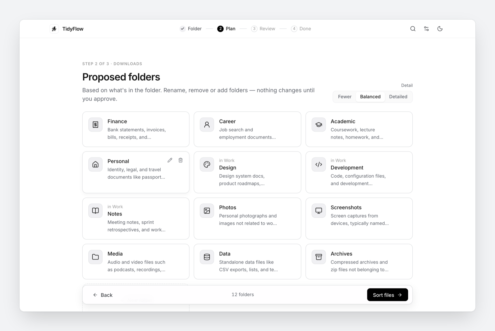
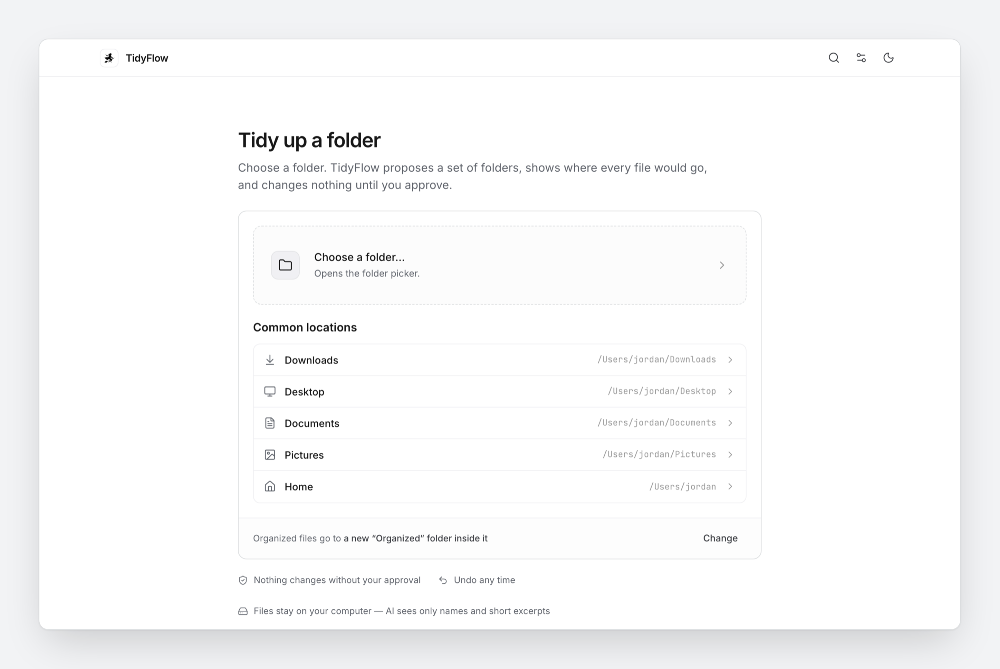
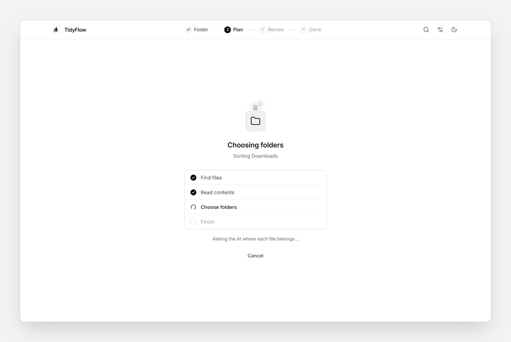
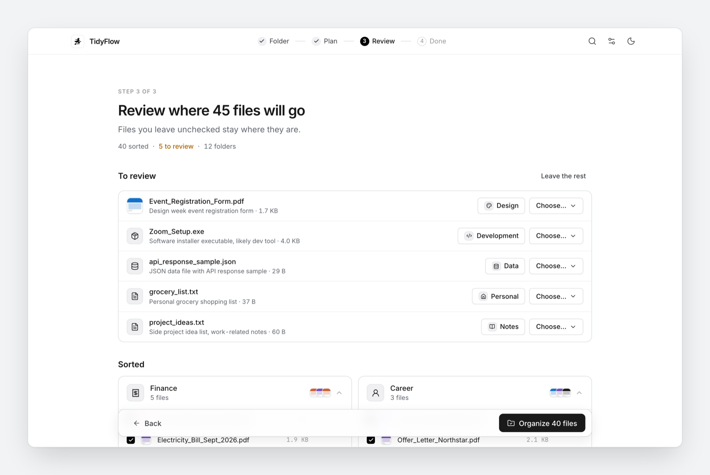
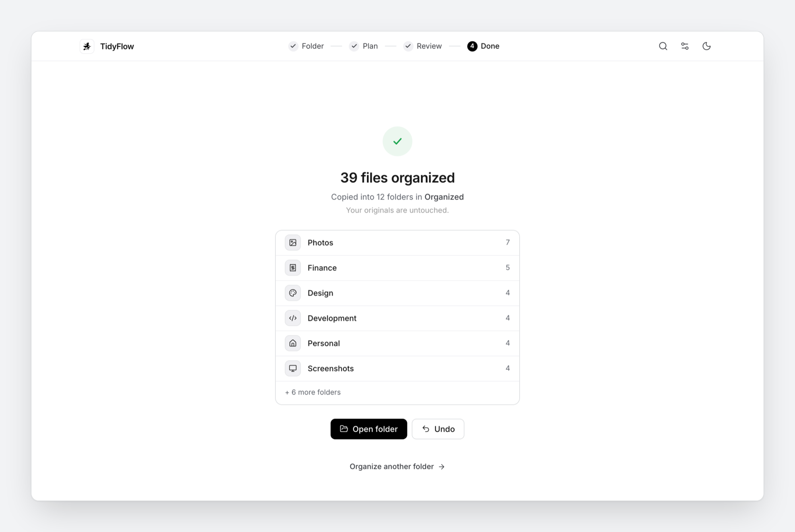

<p align="center">
  
</p>

<h1 align="center">TidyFlow</h1>

<p align="center">
  Point it at a messy folder. It reads your files, proposes a clean set of folders,
  shows you where everything will go, and only touches a file after you say so.
</p>

<p align="center">
  <a href="https://github.com/DEVJHAWAR11/Tidyflow/releases/latest"><b>Download for macOS</b></a>
  &nbsp;·&nbsp;
  <a href="https://github.com/DEVJHAWAR11/Tidyflow/releases/latest"><b>Download for Windows</b></a>
  &nbsp;·&nbsp;
  <a href="#run-from-source">Run from source</a>
</p>

<p align="center">
  <picture>
    <source media="(prefers-color-scheme: dark)" srcset="assets/screenshots/plan-dark.png" />
    
  </picture>
</p>

## How it works

<table>
  <tr>
    <td width="50%" valign="top">
      <picture>
        <source media="(prefers-color-scheme: dark)" srcset="assets/screenshots/home-dark.png" />
        
      </picture>
      <p><b>1. Pick a folder</b><br />Downloads, Desktop, or any folder. Then agree on a plan like the one above, or ask for changes in plain English.</p>
    </td>
    <td width="50%" valign="top">
      <picture>
        <source media="(prefers-color-scheme: dark)" srcset="assets/screenshots/sorting-dark.png" />
        
      </picture>
      <p><b>2. It reads every file</b><br />Contents, not just names, including the text inside scans and screenshots.</p>
    </td>
  </tr>
  <tr>
    <td width="50%" valign="top">
      <picture>
        <source media="(prefers-color-scheme: dark)" srcset="assets/screenshots/review-dark.png" />
        
      </picture>
      <p><b>3. Review</b><br />Files it is sure about are already placed. The few it isn't sure about are waiting for you.</p>
    </td>
    <td width="50%" valign="top">
      
      <p><b>4. Done, and undoable</b><br />Files are copied into an <code>Organized</code> folder. One click puts everything back.</p>
    </td>
  </tr>
</table>

## What makes it different

- **It reads the files, not just the names.** It reads text from PDFs, Office documents, code and spreadsheets, and uses on-device OCR for scans and screenshots (Apple Vision on macOS, PaddleOCR on Windows). So `scan_0412.pdf` ends up next to your other invoices.
- **The folders come from your files.** The plan is built from your actual files, not a fixed template, and the detail level runs from *Fewer* to *Detailed*.
- **Nothing happens until you approve.** By default files are copied, not moved. Every copy is checked with SHA-256, and existing files are never overwritten.
- **Undo is real.** Undo checks each file's hash before removing anything, then cleans up the empty folders it created.
- **Duplicates are flagged.** That covers exact copies and near-identical images such as resized photos or repeat screenshots.
- **It works without AI.** With no API key it falls back to rules and file types. With a key, it uses the provider you pick: DeepSeek, OpenAI, Gemini, Groq, OpenRouter, or any OpenAI-compatible endpoint.

## Privacy

Your files stay on your computer, and so do the OCR and text extraction. If you connect an AI provider, only file names and short text excerpts are sent to classify them. Passwords, API keys and tokens are scrubbed from that text before it leaves. Without a key, nothing is sent anywhere.

Settings and keys live in your user data folder (`~/Library/Application Support/TidyFlow` or `%APPDATA%\TidyFlow`) and are readable only by you.

## Install

Grab the latest build from [**Releases**](https://github.com/DEVJHAWAR11/Tidyflow/releases/latest):

| Platform | File | |
| :-- | :-- | :-- |
| macOS | `TidyFlow.dmg` | Open it and drag TidyFlow into Applications |
| Windows 10/11 | `TidyFlow-windows.zip` | Unzip and run `TidyFlow.exe` |

On first launch, open **Settings** to add an AI key (optional). The builds aren't notarized yet, so on macOS right-click the app and choose **Open** the first time. On Windows, choose **More info → Run anyway**.

## Run from source

Requires Python 3.10+ and Node.js 18+.

```bash
git clone https://github.com/DEVJHAWAR11/Tidyflow.git
cd Tidyflow
python3 -m venv venv && source venv/bin/activate   # Windows: venv\Scripts\activate
pip install -r requirements.txt
npm --prefix frontend install && npm --prefix frontend run build
python3 desktop.py
```

`desktop.py` starts the local server and opens TidyFlow in a native window. To work on the UI with hot reload, run the backend and the Vite dev server side by side:

```bash
python3 -m uvicorn src.api:app --port 8000
npm --prefix frontend run dev        # http://localhost:1420
```

## Build

Everything needed to package the desktop app is in [`build/`](build):

```
build/
├── build.py          shared build script (frontend → OCR helper → PyInstaller → installer)
├── tidyflow.spec     PyInstaller spec
├── macos/build.sh    → dist/TidyFlow.app, dist/TidyFlow.dmg
└── windows/
    ├── build.ps1     → dist/TidyFlow/TidyFlow.exe, dist/TidyFlow-windows.zip
    └── build.bat     same, for Command Prompt or double-click
```

```bash
./build/macos/build.sh            # on a Mac
```

```powershell
.\build\windows\build.ps1         # on Windows
```

PyInstaller can't cross-compile, so each platform has to be built on that platform. Pushing a `v*` tag runs [`.github/workflows/build.yml`](.github/workflows/build.yml), which builds both and attaches them to the GitHub release. Pass `--skip-deps` to either script to skip the `pip install` step.

## Command line

The same pipeline is also available from the terminal:

```bash
python3 -m src.cli run -i ~/Downloads -o ~/Downloads/Organized          # dry run with an HTML report
python3 -m src.cli run -i ~/Downloads -o ~/Organized --auto-apply --confirm
python3 -m src.cli inventory -i ~/Downloads -o ./report                  # offline, no AI
python3 -m src.cli config-set-llm deepseek <your-key>
```

Defaults such as the confidence threshold, OCR, batch size and duplicate sensitivity live in [`config.yaml`](config.yaml).

## Project layout

```
src/            FastAPI server, classification pipeline, CLI
  scanner.py      file discovery and ignore rules
  extractor.py    text from PDFs, Office files, code
  ocr_engine.py   Apple Vision / PaddleOCR
  hashing.py      SHA-256 and perceptual-hash duplicates
  llm_provider.py batched AI classification
  ai_assistant.py folder planning and plain-English edits
  applier.py      verified copy / move and undo
frontend/       React + TypeScript + Tailwind UI
build/          desktop packaging for macOS and Windows
tests/          pytest suite
```

```bash
python3 -m pytest tests/
```
